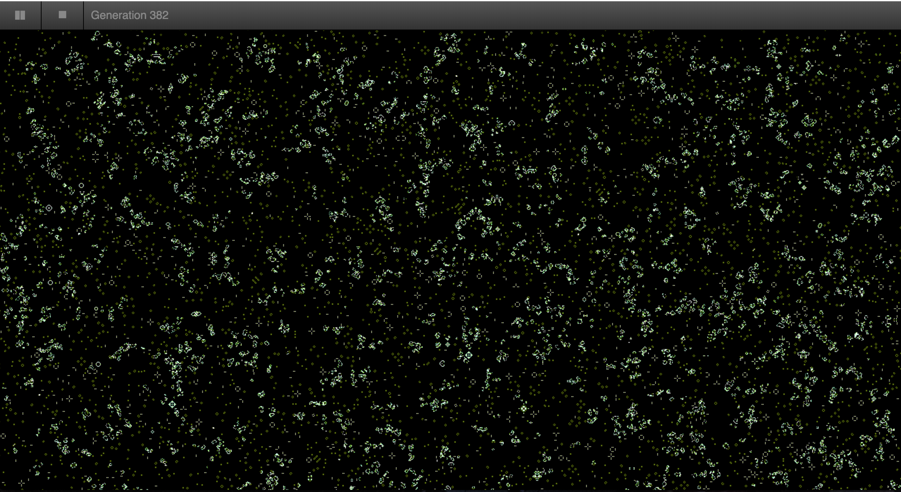

# GPU-Accelerated Conway's Game of Life

[Live demo](https://dcthetall-webgl-life.herokuapp.com)

This project is a WebGL implementation of GPU-accelerated
Conway's Game of Life. The source code is written in TypeScript
and GLSL and is bundled with Webpack.

The program saves each previous frame which it then saves as a texture.
Each subsequent cell is calculated by sampling the texture from the
revious frame, allowing the computation step to take advantage of the
parallelism of GPUs.

This implementation allows you to calculate up to 10^5 cells in
each frame at over 60 frames a second (on my laptop, which has a
run of the mill Intel GPU), showing the power of general purpose
graphics processing unit programming.
